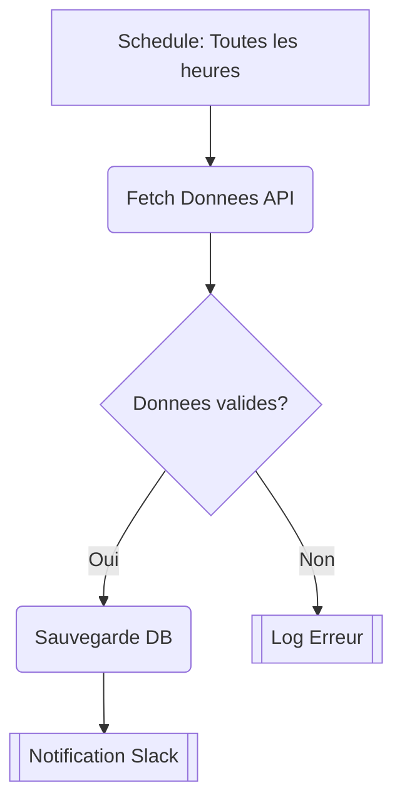

# Visualisation : Convention Mermaid

## Regle fondamentale

Chaque workflow `src/trigger/<name>.ts` DOIT avoir un diagramme correspondant `docs/workflows/<name>.md`.
Quand le code d'un workflow change, le diagramme DOIT etre mis a jour.

## Format du fichier diagramme

```markdown
# <Nom du Workflow>

<Description en une phrase du workflow>

## Diagramme

\`\`\`mermaid
graph TD
    ...
\`\`\`

## Notes

- Trigger : <comment le workflow est declenche>
- Services utilises : <liste des services>
- Frequence : <si schedule, indiquer le cron>
```

## Conventions de formes Mermaid

| Type | Forme Mermaid | Exemple |
|------|---------------|---------|
| Trigger (webhook, schedule) | `[Rectangle]` | `A[Webhook: Reception Lead]` |
| Task/Service call | `(Arrondi)` | `B(Enrichissement Clearbit)` |
| Condition (if/switch) | `{Losange}` | `C{Score > 50?}` |
| Wait (pause, approval) | `((Cercle))` | `D((Attente Validation))` |
| Agent IA | `{{Hexagone}}` | `E{{Analyse Sentiment IA}}` |
| Resultat final | `[[Rectangle double]]` | `F[[Email Envoye]]` |

## Conventions de liens

- Flux normal : `-->` avec label si pertinent (`-->|Oui|`)
- Flux d'erreur : `-.->` en pointille
- Direction : toujours `TD` (Top-Down)

## Exemple


