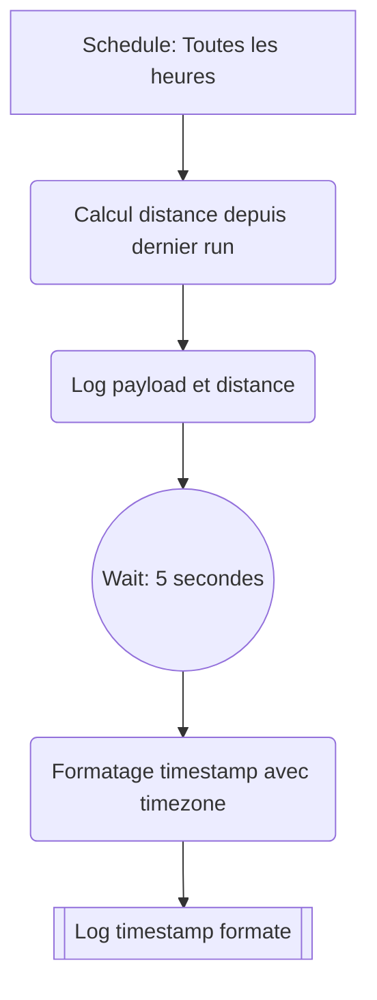

# First Scheduled Task

Tache planifiee qui s'execute toutes les heures et affiche le timestamp formate.

## Diagramme

## Notes

- Trigger : Cron `0 * * * *` (toutes les heures)
- Services utilises : aucun
- Duree max : 5 minutes de compute
