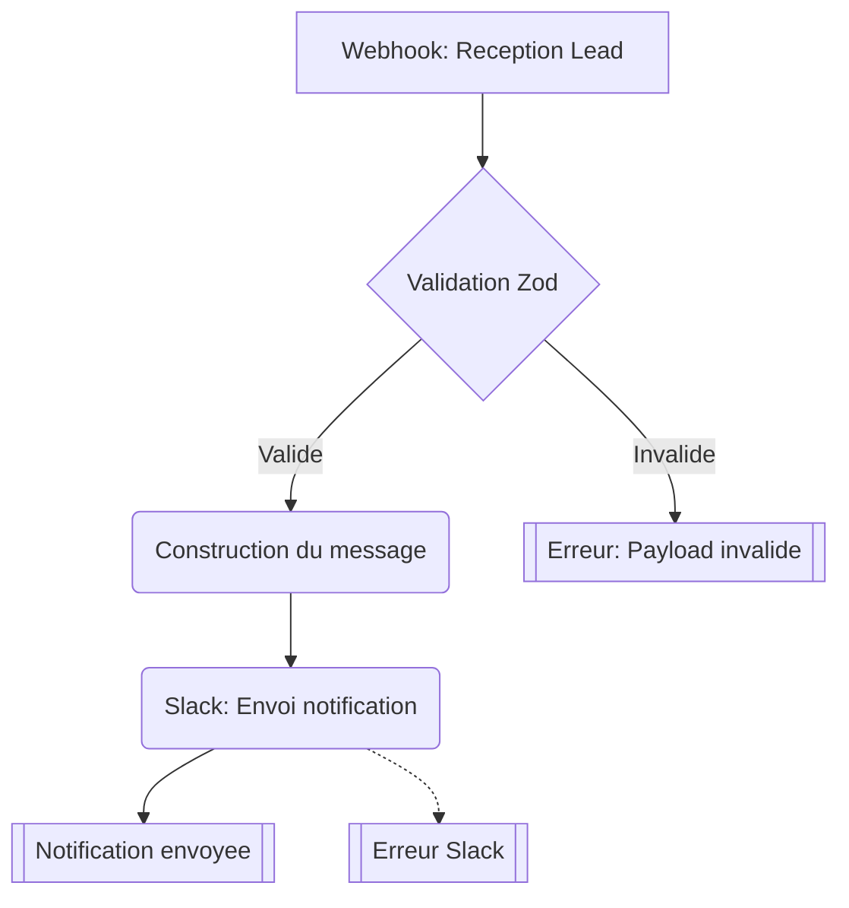

# Notify Lead

Recoit les donnees d'un nouveau lead (via webhook/API) et envoie une notification formatee sur Slack.

## Diagramme

## Notes

- Trigger : Appel API / webhook (schemaTask)
- Services utilises : `slack.ts` (sendAlert)
- Validation : Zod (name, email, company?, source)
- Env vars requises : `SLACK_BOT_TOKEN`, `SLACK_ALERTS_CHANNEL`
