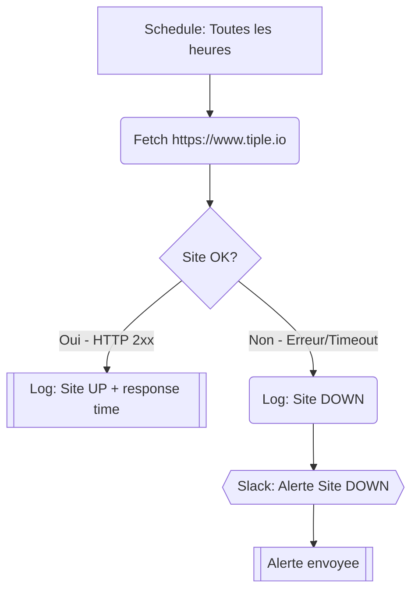

# Uptime Monitor

Verifie toutes les heures que le site tiple.io est en ligne et envoie une alerte Slack si le site est down.

## Diagramme

## Notes

- Trigger : Cron `0 * * * *` (toutes les heures)
- Services utilises : `slack.ts` (sendAlert)
- Duree max : 60 secondes de compute
- Env vars requises : `SLACK_BOT_TOKEN`, `SLACK_ALERTS_CHANNEL`
