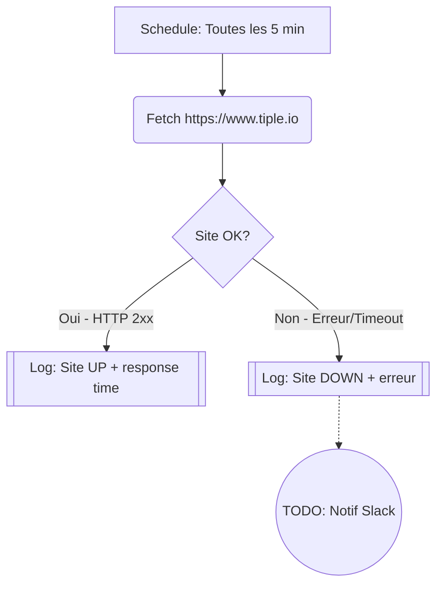

# Uptime Monitor

Verifie toutes les 5 minutes que le site tiple.io est en ligne et mesure le temps de reponse.

## Diagramme

## Notes

- Trigger : Cron `*/5 * * * *` (toutes les 5 minutes)
- Services utilises : aucun (fetch natif avec retry)
- Duree max : 60 secondes de compute
- Evolution prevue : ajouter notification Slack quand le site est down
